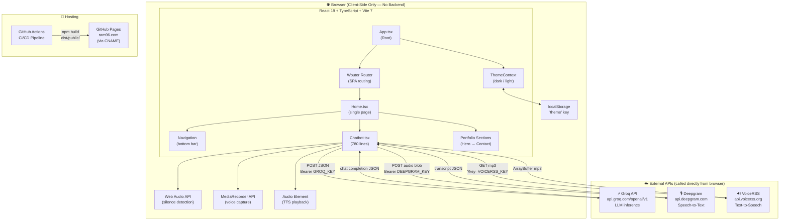
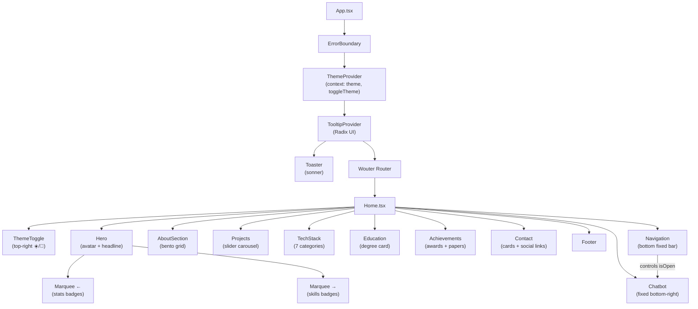
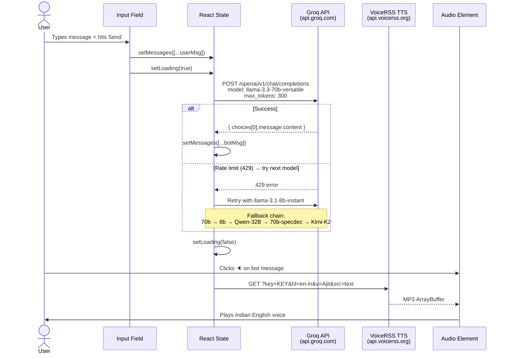
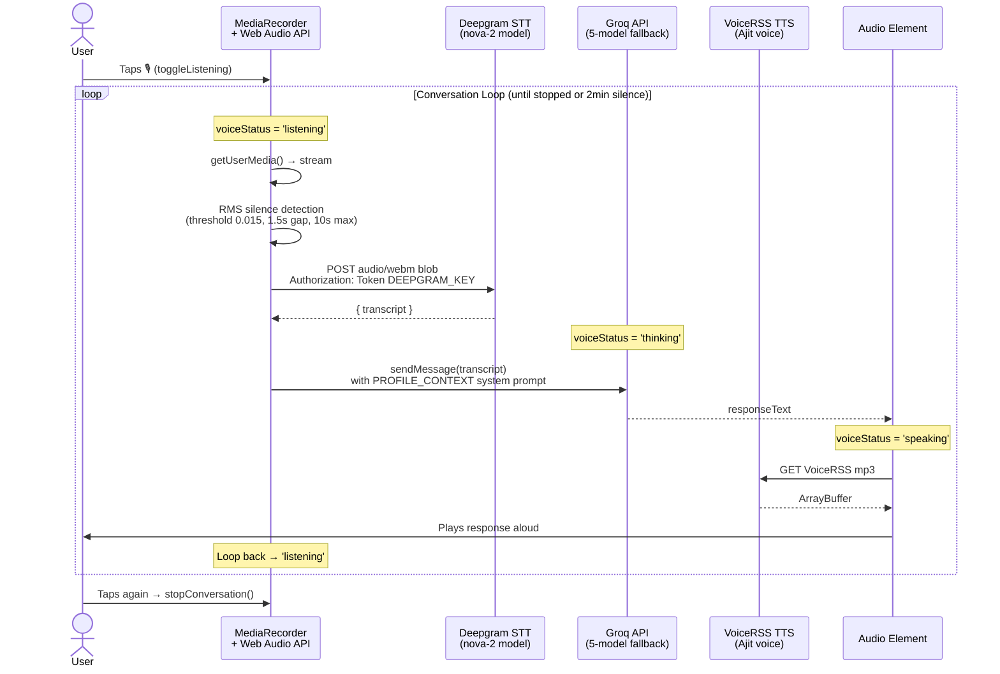
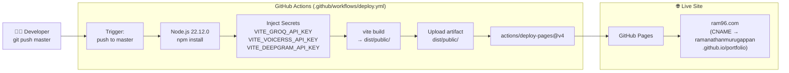
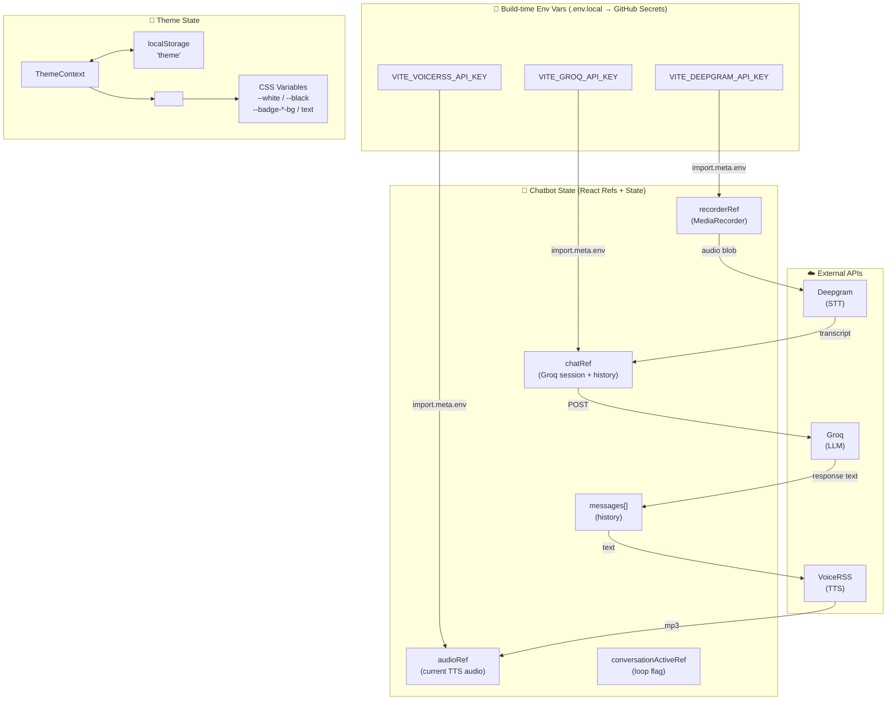
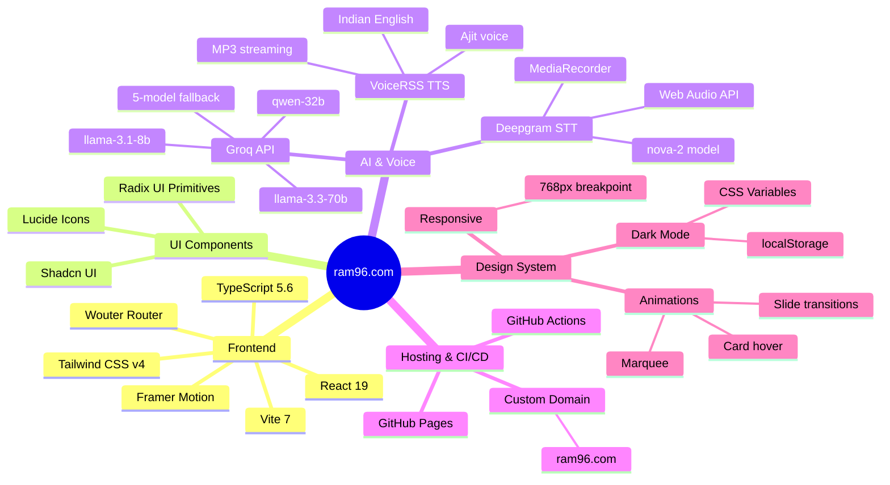

# Architecture Diagram — ram96.com Portfolio

## 1. System Overview

---

## 2. React Component Tree

---

## 3. AI Chatbot — Text Mode Flow

---

## 4. AI Chatbot — Voice Mode Flow

---

## 5. Build & Deploy Pipeline

---

## 6. Data & State Flow

---

## 7. Tech Stack Summary

---

## Key Numbers

| Metric | Value |
|--------|-------|
| Total components | 13 major + 12 UI primitives |
| Lines of TSX/TS | ~3,005 |
| Lines of CSS | ~675 |
| External APIs | 3 (Groq, Deepgram, VoiceRSS) |
| LLM fallback models | 5 |
| Tech stack categories | 7 |
| Technologies listed | 70+ |
| Build output | `dist/public/` → GitHub Pages |
| Live URL | [ram96.com](https://ram96.com) |
| Backend | None — 100% client-side |
