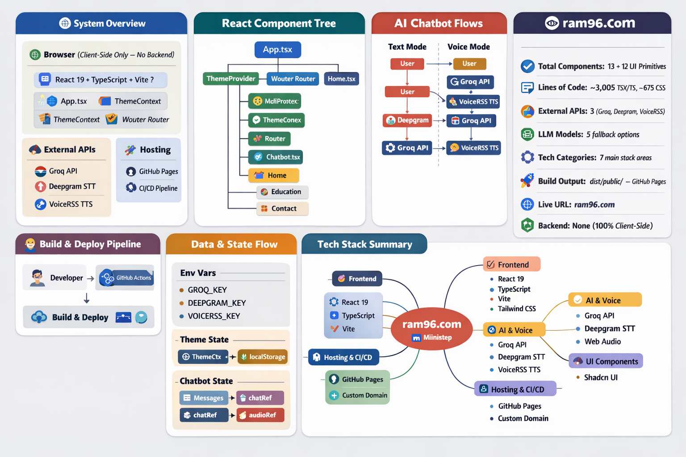
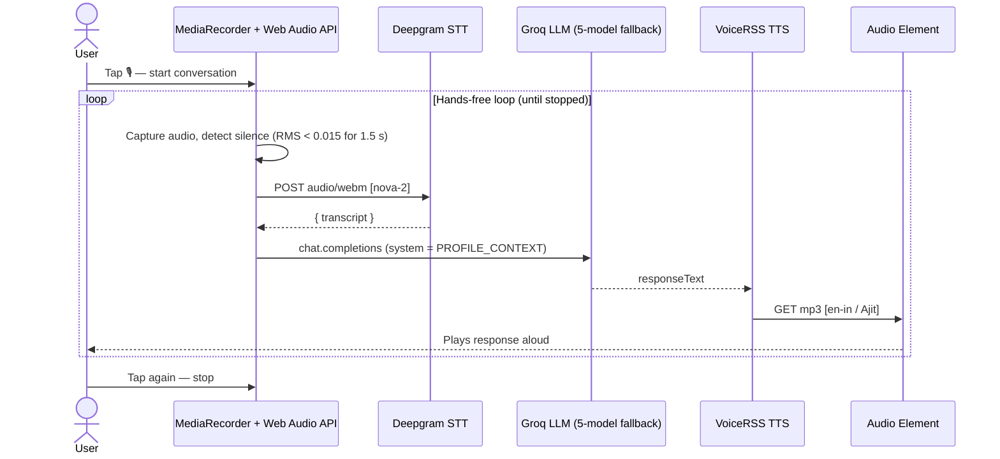

# Architecture — ram96.com

---

## Voice Conversation Flow

---

## Key Facts

| | |
|---|---|
| **Backend** | None — 100% client-side SPA |
| **LLM fallback chain** | 5 models (70b → 8b → Qwen-32B → 70b-specdec → Kimi-K2) |
| **Voice pipeline** | Deepgram STT → Groq LLM → VoiceRSS TTS |
| **Theme** | CSS variables + localStorage, zero flash on load |
| **Build** | Vite 7 → `dist/public/` → GitHub Pages |
| **Live URL** | [ram96.com](https://ram96.com) |
